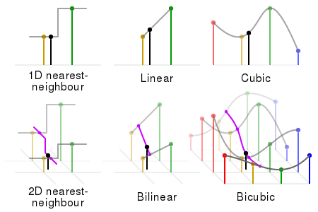
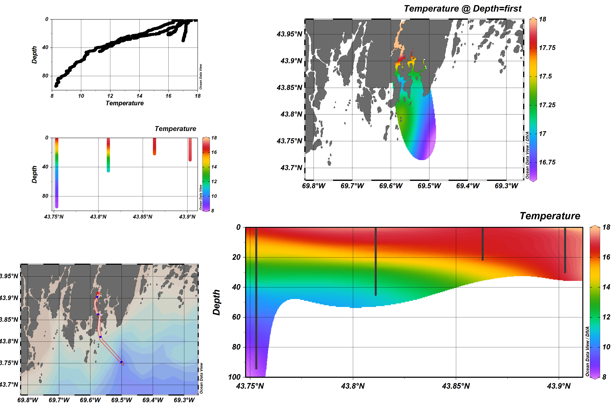

This lab focuses on visualizing temporal and spatial patterns in oceanographic cruise data, i.e. how do parameters vary upriver compared with the open ocean? how do parameters vary with depth? how does one station change over the season? The tools you are introduced to here can be used to graph and analyze data in your labs, your independent research projects and the cruise data gathered throughout the semester. Be sure to save any scripts that you develop so you can continue to use them.

# A. Visualization of discrete data using contour plots

In this section, we are going to visualize how parameters vary at each station for each cruise.

## A1. Importing data

We are going to look at some of the discrete data, taken from the Niskin bottles. To do this, we need to create another csv file from the Colby_cruise_data_2012-2017.xlsx sheet like last week. But let's start by setting our working directory.

```{r}
setwd('C:/Users/nmayot/Documents/PostDoc/teaching supervise/Colby 2019/Rbigelow/Tutorials/Colby2019/Lab3')
```

### Creating discrete data csv file

1. Open Colby_cruise_data_2012-2017.xlsx
2. Open a new blank Excel file
2. Go to the "discrete data" tab
3. Select and copy the following columns: date, cruise, station, depth, SiO4,	NO3+2,	PO4,	NH4,	Bacteria Conc,	Viral Conc,	Chl Total,	CHL <20um,	CHL<3um,	Flowcam Biomass.
5. Paste the columns into the blank Excel file
6. Delete the rows from 2012 - 2015 and 2017 i.e. so the only year left is 2016.
7. Delete the dates column and the top two rows (the row of units and the row contain the units of a few of the columns)
8. Press CTRL-F on Windows, or the Command-F on a Mac, to bring up the "Find and Replace" window.
9. Go to the Replace tab, enter "Cruise" in the "Find What" box and nothing in the "Replace with" box, hit "Replace all"
10. Repeat 9 for the word "BLOS" and close the window
11. Modify the names of the columns: Cruise, Station, Depth, SiO4, NO3_NO2, PO4, NH4, Bacteria_Conc, Viral_Conc, Chl_Total, CHL_20um, CHL_3um, Flowcam_Biomass
11. Save the file as a CSV (Comma Delimited) with a sensible name e.g. Colby_discrete_data_2016.csv

### Importing the data

Let's import the data as before.

```{r, warning=FALSE}
# read in the whole csv file
discreteDATA <- read.csv('Colby_discrete_data_2016.csv', header = TRUE)
```
## A2. Data wrangling and creating contour plots

We are going to create a filled 2D contour plot for the surface data, for station vs cruise. To do this we are going to use the `ggplot2` and `gridExtra` libraries, so let's load them into our workspace.

```{r, warning=FALSE}
# necessary packages
library("ggplot2")
library("gridExtra")
```


Now we can extract the surface data from our `discreteDATA` data frame and plot the result. For this, we need:

1. To know at which depth do we have data? - using the function `unique()`
2. Subset the data frame for the shallower depth available - using the function `subset()`
3. Build a 2D plot with three variables (Station, Cruise and NO3_NO2) - using the packages `ggplot2`

```{r, fig.height = 4, fig.width=15}
# At which depth do we have data? 
unique(discreteDATA$Depth)

# extracting data at 2m using subset() and plotting them:

#    with colored points
p1 <- ggplot(subset(discreteDATA, Depth == 2), aes(x=Cruise, y=Station)) +
  geom_point(aes(color=NO3_NO2)) +
  scale_color_gradient(low="#deebf7", high="#3182bd",limits=c(0,8),name="NO3+NO2 (uM)") +
  ylab("Station number") + xlab("Cruise number")

#    with a 2D plot
p2 <- ggplot(subset(discreteDATA, Depth == 2), aes(x=Cruise, y=Station)) +
  geom_tile(aes(fill=NO3_NO2)) +
  scale_fill_gradient(low="#deebf7", high="#3182bd",limits=c(0,8),name="NO3+NO2 (uM)") +
  ylab("Station number") + xlab("Cruise number")

#    with a 2D plot and a discrete colorbar
p3 <- ggplot(subset(discreteDATA, Depth == 2), aes(x=Cruise, y=Station)) +
  geom_tile(aes(fill = cut(NO3_NO2,c(0,2,4,6,8)))) +
  scale_fill_brewer(type="seq",palette="Blues",name="NO3+NO2 (uM)") +
  ylab("Station number") + xlab("Cruise number")

# Easy way to mix multiple plots on the same page
grid.arrange(p1,p2,p3, ncol=3)
```

##### **Important side note about these plots**

We wanted to have a plot to show how the nutrient concentrations (NO3 + NO2) vary between the stations and the cruises. Note that this is clearer in the last plot.


# B. Visualization of continuous data using section plots

In this section, we are going to visualize spatial changes in terms of depth and station for a given cruise.

## B1. Importing and wrangling data

For this section, we are going to use the csv file we made last day which contains all the continuous CTD profiles, and extract out one cruise. We could use the contour plot function `geom_contour()` and/ or the same plotting function as before to plot e.g. the temperature profile at each station:

```{r, fig.height = 4, fig.width=15}
# importing the CTD data
CTDdata <- read.csv('Colby_cruise_data_2012-2017.csv')

# extracting data for the cruise on September 8th 2016, and plot the temperature with:

#    a 2D contour plot
p1 <- ggplot(subset(CTDdata, Date == 20160908), aes(x=Station, y=Depth)) +
  geom_contour(aes(z = Temperature))

#    a 2D filled contour plot with data from different depth ranges
p2 <- ggplot(subset(CTDdata, Date == 20160908), aes(x=Station, y=Depth)) +
  geom_tile(aes(fill = Temperature))

grid.arrange(p1,p2, ncol=2)
```

Hmmm... Not really good...

The first 2D contour plot failed because `Contour requires single ``z`` at each combination of ``x`` and ``y``.` We cannot provide two different temperature values for the same depth and cruise to the function `geom_contour()`.

Regarding the 2D filled contour plot. We end up with distinct bands: one band for each depth sampled per station. This is because no interpolation  has been done by the plotting function. Therefore, we need to provide an interpolated dataset to these two plotting functions. For this, we need to use a **for-loop**.

## B2. Coding technique: for-loops

When you want to repeat the same bit of code a certain number of times, a for-loop can be your friend. For example, if you would like to plot a section for each cruise, rather than type out the code for each cruise individually, we can just write it once and iterate or *loop* over the code.

Let's start with a simple example:

#### Example: print the statement "hello" four times
```{r}
for (ii in 1:4) {
  print("hello")
}
```

#### Example: print the statement "hello" four times, including the number at the start of the statement e.g. "1 hello"
```{r}
for (ii in 1:4) {
  print(paste(ii,"hello"))
}
```

## B3. Plotting oceanographic section

We need to make our Temperature data into a matrix, where each row represents a depth, and each column represents a different station. The depth data are not consistent; they are all at irregular intervals. Therefore, to put the temperature data into a matrix, we are going to need to bin the data into regular depth intervals of 1m.

```{r, fig.height = 4, fig.width=5, warning=FALSE}

#creating an empty matrix with 100 rows (i.e. for 100 depths) and 4 columns (i.e. one for each station)
TEM <- matrix(NA,nrow = 100, ncol = 4)

#looping through each station
for (st in 1:4){
  
  # extracting/ subsetting the relevant station from the cruiseData data frame
  stationData <- subset(CTDdata, Station == st & Date == 20160908)
  
  #looping through each depth interval (from 1m to 100m)
  for (j in 1:100){
    
    # binned temperature value for given depth interval
    temp <- mean(stationData[ceiling(stationData$Depth)==j,'Temperature']) 
    
    # assinging the binned temperature to the j-th row and st-th column of the TEM matrix
    TEM[j,st] <- temp
  }
}

st = 1
stationData <- subset(CTDdata, Station == st & Date == 20160908)

ggplot() +
  geom_point(data = stationData, aes(y=Temperature, x=Depth, color="Raw")) +
  geom_point(aes(y=TEM[,1],x=.5:99.5),color="red") +
  geom_line(aes(y=TEM[,1],x=.5:99.5,color="Binned every 1m")) +
  scale_x_reverse(limits = c(30,0), minor_breaks =1:100) +
  labs(color = " ", x="Depth (m)", y="Temperature (deg C)", title="Example of data binning") +
  coord_flip()

```

__Note:__ we used two ways to subset the data frame, by putting the condition in the function `subset()` and in `[ ]` 

Now we've created our matrix, we can plot the temperature section with `ggplot2` functions. For this, we need to build a data frame from the matrix

```{r, fig.height = 3, fig.width=6, warning=FALSE}
# Create the data frame
tem <- as.vector(TEM) # Temperature
sta <- as.vector(t(matrix(1:4,ncol=100,nrow=4)))  # Station number
lat <- as.vector(t(matrix(c(43.903,43.863,43.811,43.753),ncol=100,nrow=4)))  # Station latitude
lon <- as.vector(t(matrix(c(-69.578,-69.575,-69.568,-69.501),ncol=100,nrow=4)))  # Station longitude
dep <- as.vector(matrix(1:100,ncol=4,nrow=100))   # Depth
CTD <- data.frame(Station=sta, Latitude=lat, Longitude=lon, Depth=dep, Temperature=tem) 

# 2D plot
ggplot(CTD, aes(x=Station, y=Depth)) +
  geom_tile(aes(fill=Temperature)) +
  geom_contour(aes(z = Temperature),breaks = 10:17,color="white") +
  scale_y_reverse() +
  scale_fill_continuous(breaks = 11:17) +
  labs(y="Depth (m)", fill="Temperature (deg C)")
```

#### Example: How do we change the color scheme?

We can use one of the Color Brewer palettes. Color Brewer was a project which created a lot of different color palettes for thematic maps. There are different types of color palettes depending on your needs (e.g. sequential color scale, diverging color scale, quantative scales). It has a cool web-interface (http://colorbrewer2.org/#) where you can play around with the palettes. What is good about Color Brewer is the sequential color palettes are made from at most 3 colors, and are altered by changing the hue. This makes the maps colorblind-friendly and prevents artificial sharp edges between color changes. `gglot2` has a function for the Color Brewer palettes: `scale_*_brewer()` and `scale_fill_distiller()`. Check out the help to see a list of the sequential palette names you can use.

```{r, fig.height = 3, fig.width=6, warning=FALSE}
ggplot(CTD, aes(x=Station, y=Depth)) +
  geom_tile(aes(fill=Temperature)) +
  geom_contour(aes(z = Temperature),breaks = 11:17,color="white") +
  scale_y_reverse() +
  labs(y="Depth (m)", fill="Temperature (deg C)") +
  scale_fill_distiller(palette="Reds", direction=1,breaks = 11:17)
```

## B4. 2D interpolation with oceanographic data

What's happening when we plot the temperature section with the variable "Latitude" instead of "Station"?

```{r, fig.height = 3, fig.width=6, warning=FALSE}
ggplot(CTD, aes(x=Latitude, y=Depth)) +
  geom_tile(aes(fill=Temperature)) +
  geom_contour(aes(z = Temperature),breaks = 11:17,color="white") +
  scale_y_reverse() +
  labs(y="Depth (m)", fill="Temperature (deg C)") +
  scale_fill_distiller(palette="Reds", direction=1,breaks = 11:17)
```

It is not a continuous 2D plot because the spacing between sampling station latitudes is not constant. We need to transform the data into equally spaced temperature profiles. In other terms, we need to interpolate our temperature data (z) on a uniform 2D grid (X-Y plane, where x = Latitude and y = Depth). For this, several multivariate interpolation functions exist, e.g. Nearest-neighbor interpolation, Bilinear interpolation, Bicubic interpolation, Delaunay triangulation...



This code below uses the `akima` package to perform a bilinear interpolation on our depth-latitude-temperature data. The `interp()` function performs the interpolation and then the results are converted into a data.frame.

```{r, fig.height = 3, fig.width=6, warning=FALSE}
# install.packages("akima")
library("akima")

# Select the data for the interpolation
x <- lat
y <- dep
z <- tem

# Remove NA values
x <- x[!is.na(tem)]
y <- y[!is.na(tem)]
z <- z[!is.na(tem)]

# bivariate linear interpolation
CTD.li <- interp(x, y, z)

# Prepare the data frame for ggplot()
CTD.li$Temperature <- as.vector(CTD.li$z)
CTD.li$Latitude <- as.vector(matrix(CTD.li$x,ncol=40,nrow=40))
CTD.li$Depth <- as.vector(t(matrix(CTD.li$y,ncol=40,nrow=40)))
CTD.li <- as.data.frame(CTD.li)

ggplot() +
  geom_tile(data = CTD.li, aes(x=Latitude, y=Depth, fill=Temperature)) +
  geom_contour(data = CTD.li, aes(x=Latitude, y=Depth, z = Temperature),breaks = 11:17,color="white") +
  geom_point(data = subset(CTD, !is.na(Temperature)), aes(x=Latitude, y=Depth),color="black") +
  scale_y_reverse() +
  labs(y="Depth (m)", fill="Temperature (deg C)") +
  scale_fill_distiller(palette="Reds", direction=1,breaks = 11:17)
```

##### **Side note about Ocean Data View (ODV)**

In oceanography, many researchers are using the Ocean Data View ([ODV](https://odv.awi.de)) software to do that kind of plots. It is a free software for the interactive exploration, analysis and visualization of oceanographic data. Below is an example with our data:



# Assignment (in lab)

1.  a. Plot a contour plot for different discrete variables. Can you figure out how to change the color scheme? 
    b. Try plotting a station-by-depth contour plot for 1 cruise (instead of station-by-cruise)
    c. Try plotting a depth-by-cruise contour plot for 1 station.
    d. Try plotting a contour plot of your choice for a different cruise.
2. Plot an oceanographic section for different variables from the CTD casts.
