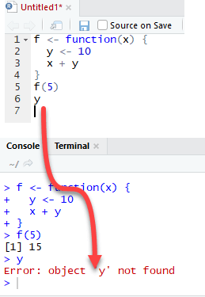

This lab focuses on visualizing  temporal and spatial patterns in oceanographic cruise data with a focus on changes over time. The tools you are introduced to here can be used to graph and analyze data in your labs, your independent research projects and the cruise data gathered throughout the semester. Be sure to save any scripts that you develop so you can continue to use them.

# A. Importing and wrangling data

Today, we are going to create plots of depth vs time for a given year and station, so we are going to need to wrangle our data into a different form compared to yesterday.

Let's start by importing the data as before.

```{r}
setwd('C:/Users/nmayot/Documents/PostDoc/teaching supervise/Colby 2019/Rbigelow/Tutorials/Colby2019/Lab4')

# read in the whole csv file
CTDdata <- read.csv('Colby_cruise_data_2012-2017.csv')
```

Our first big step is to format the dates into a more usable form.

```{r}
#making a list of the dates of each cruise
dates <- CTDdata$Date

# converting our dates to R date-times
Rdates <- as.Date(as.character(dates),"%Y%m%d")

# making a list of the year
yyyy <- as.numeric(format(Rdates,"%Y"))

# making a list of the months
mm <- as.numeric(format(Rdates,"%m"))

# making a list of the days
dd <- as.numeric(format(Rdates,"%d"))

# determining the day of year (Julian Day) for each date
jday <- as.numeric(format(Rdates,"%j"))

# add these to our dataframe
CTDdata$Rdates <- Rdates
CTDdata$year <- yyyy
CTDdata$month <- mm
CTDdata$day <- dd
CTDdata$jday <- jday
```

We just created a julian day (day-of-year) variable which we are going to use as our x-axis. Depth will be our y-axis. We need to extract from the main `CTDdata` the data for a specific year and station before we can make our plot.

```{r}
# extracting our chosen year and station of data from CTDdata
stationData <- subset(CTDdata, year == 2016 & Station == 4)

# making a list of the julian day each cruise took place on
alljday <- unique(stationData$jday)

#counting how many different days of year (i.e. cruises) we have
numCols <- length(alljday)

#creating an empty matrix with 100 rows (i.e. for 100 depths) and a column for each cruise in this year
TEM <- matrix(NA,nrow = 100, ncol = numCols)

#looping through each cruise
for (j in seq_along(alljday)){
  #extracting the relevant cruise from the stationData data frame
  jdayData <- subset(stationData, jday == alljday[j])
  
  #looping through each depth interval (from 1m to 100m)
  for (d in 1:100){
    
    #binned temperature value for given depth interval
    temp <- mean(jdayData[ceiling(jdayData$Depth) == d,"Temperature"]) 
    
    #assinging the binned temperature to the d-th row and j-th column of the TEM matrix
    TEM[d,j] <- temp
  }
}

```

# B. Plotting temporal changes

## B1. Temporal changes over a year at one station

We have manipulated our data into a form where we can now plot it. We are going to use the same plotting function as we used yesterday for doing the section plots.

```{r}
library("ggplot2")

# Create the data frame
tem <- as.vector(TEM) # Temperature
jda <- as.vector(t(matrix(alljday,ncol=100,nrow=length(alljday))))  # Station number
dep <- as.vector(matrix(1:100,ncol=length(alljday),nrow=100))   # Depth
CTD <- data.frame(JulianDay=jda, Depth=dep, Temperature=tem) 

# 2D plot
ggplot(CTD, aes(x=JulianDay, y=Depth)) +
  geom_tile(aes(fill=Temperature)) +
  geom_contour(aes(z = Temperature),color="white") +
  scale_y_reverse() +
  scale_fill_continuous(limits = c(8,18)) +
  labs(y="Depth (m)", fill="Temperature (deg C)")
```

## B2. Coding technique: Functions

Functions are blocks of code which when called, perform a specific task. Usually you give them an input and they give you an output. We've used lots of different R in-built functions e.g. `read.csv()`, `mean()`, etc. We can write our own functions for our own specific tasks.

#### Example: write a function which adds two numbers

```{r}
addition <- function(a,b){
  return(a+b)
}

addition(9,3)
```

As shown in this image below, an essential feature of functions is that the variables used within are local. This means that their scope lies within -and is limited to- the function itself and are therefore invisible outside the function body.



Let's write two functions: the first one to turn a variable from the `CTDdata` data frame into a matrix, and the second one to plot this variable over time at one station. To do this, we'll just copy the code from above and wrap it in a function.

```{r}
# function for converting our data into a matrix for a given year and station
col2matrix_yr_st <- function(dataset,yr,st,colName){
  # DESCRIPTION OF ARGUMENTS:
  # -----  dataset = data frame with CTD data
  # -----  yr = year wanted
  # -----  st = station wanted
  # -----  colName = variable wanted 
  
  # extracting our chosen year and station of data from CTDdata
  subdata <- subset(dataset, year == yr & Station == st)
  
  # making a list of the julian day each cruise took place on
  uniqj <- unique(subdata$jday)
  
  #counting how many different days of year (i.e. cruises) we have
  nbcol <- length(uniqj)
  
  #creating an empty matrix with 100 rows (i.e. for 100 depths) and a column for each cruise in this year
  MAT <- matrix(NA,nrow = 100, ncol = nbcol)
  
  #looping through each cruise
  for (j in seq_along(uniqj)){
  
    #extracting the relevant cruise from the stationData data frame
    subdataj <- subset(subdata, jday == uniqj[j])
    
    #looping through each depth interval (from 1m to 100m)
    for (d in 1:100){
      
      #binned temperature value for given depth interval
      djvalue <- mean(subdataj[ceiling(subdataj$Depth) == d,colName]) 
      
      #assinging the binned temperature to the d-th row and j-th column of the MAT matrix
      MAT[d,j] <- djvalue
    }
  }
  
  
  # we can only return one object from a function, but we want to return two... so in this case, we can put the two objects into a list and return the list
  returnList = list(mat = MAT, alljday = uniqj)
  return(returnList)
}
```
```{r}
library("akima")
sectionPlot <- function(x,z,zLims,figName,clbName){
  # DESCRIPTION OF ARGUMENTS:
  # -----  x = x-variable, z = variable to plot in color,
  # -----  zLims = limits of the colorscale,
  # -----  title = title to give the figure
  # -----  colName = label for the colorbar  
  
  # Create the data frame
  xvar <- as.vector(t(matrix(x,ncol=100,nrow=length(x))))  # Station number
  zvar <- as.vector(z) # Temperature
  yvar <- as.vector(matrix(1:100,ncol=length(x),nrow=100))   # Depth
  CTD <- data.frame(JulianDay=xvar, Depth=yvar, Zvalue=zvar) 
  
  # Remove NA values
  x <- xvar[!is.na(zvar)]
  y <- yvar[!is.na(zvar)]
  z <- zvar[!is.na(zvar)]
  
  # bivariate linear interpolation
  CTD.li <- interp(x, y, z)
  
  # Prepare the data frame for ggplot()
  CTD.li$variable <- as.vector(CTD.li$z)
  CTD.li$JulianDay <- as.vector(matrix(CTD.li$x,ncol=ncol(CTD.li$z),nrow=nrow(CTD.li$z)))
  CTD.li$Depth <- as.vector(t(matrix(CTD.li$y,ncol=ncol(CTD.li$z),nrow=nrow(CTD.li$z))))
  CTD.li <- as.data.frame(CTD.li)
  
  # 2D plot
  p <- ggplot() +
        geom_tile(data = CTD.li, aes(x=JulianDay, y=Depth, fill=variable)) +
        geom_contour(data = CTD.li, aes(x=JulianDay, y=Depth, z = variable),color="white") +
        geom_point(data = subset(CTD, !is.na(Zvalue)), aes(x=JulianDay, y=Depth),color="black") +
        scale_y_reverse() + scale_fill_continuous(limits=zLims) +
        labs(y="Depth (m)", fill=clbName, title = figName)
  
  return(p)
}
```

Let's try our functions for a different year:

```{r}
output <- col2matrix_yr_st(dataset = CTDdata, yr = 2017, st = 4, colName = "Temperature")
T2017st4 <- sectionPlot(output$alljday, output$mat, c(8,18), "Station 4, 2017", "Temperature (deg C)")
T2017st4
```

Or what about a plot for all the stations in 2016:
```{r, fig.width=15, warning=FALSE}
library(gridExtra)

yyyy <- 2016
for (i in 1:4){
  output <- col2matrix_yr_st(CTDdata, yyyy, i, "Temperature")
  p <- sectionPlot(output$alljday, output$mat, c(8,18), 
              paste("Station ",i,", ",yyyy, sep=""), "Temperature (deg C)")
  eval(parse(text=paste("p",i,"<- p",sep="")))
}
grid.arrange(p1,p2,p3,p4, ncol=2)
```
